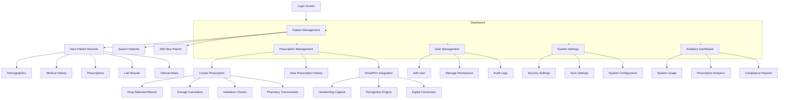

```mermaid
flowchart TD
    Login[Login Screen] --> Dashboard
    
    subgraph Dashboard
        PatientMgmt[Patient Management]
        PrescriptionMgmt[Prescription Management]
        UserMgmt[User Management]
        Settings[System Settings]
        Analytics[Analytics Dashboard]
    end
    
    Dashboard --> PatientMgmt
    Dashboard --> PrescriptionMgmt
    Dashboard --> UserMgmt
    Dashboard --> Settings
    Dashboard --> Analytics
    
    PatientMgmt --> PatientSearch[Search Patients]
    PatientMgmt --> PatientAdd[Add New Patient]
    PatientMgmt --> PatientView[View Patient Records]
    
    PatientView --> Demographics[Demographics]
    PatientView --> MedicalHistory[Medical History]
    PatientView --> Prescriptions[Prescriptions]
    PatientView --> LabResults[Lab Results]
    PatientView --> Notes[Clinical Notes]
    
    PrescriptionMgmt --> NewPrescription[Create Prescription]
    PrescriptionMgmt --> PrescriptionHistory[View Prescription History]
    PrescriptionMgmt --> SmartPenIntegration[SmartPen Integration]
    
    NewPrescription --> DrugSelection[Drug Selection/Search]
    NewPrescription --> DosageCalculation[Dosage Calculation]
    NewPrescription --> ValidationChecks[Validation Checks]
    NewPrescription --> PharmacyTransmission[Pharmacy Transmission]
    
    SmartPenIntegration --> HandwritingCapture[Handwriting Capture]
    SmartPenIntegration --> RecognitionEngine[Recognition Engine]
    SmartPenIntegration --> DigitalConversion[Digital Conversion]
    
    UserMgmt --> UserAdd[Add User]
    UserMgmt --> UserPermissions[Manage Permissions]
    UserMgmt --> AuditLogs[Audit Logs]
    
    Settings --> SecuritySettings[Security Settings]
    Settings --> SyncSettings[Sync Settings]
    Settings --> SystemConfiguration[System Configuration]
    
    Analytics --> UsageStats[System Usage]
    Analytics --> PrescriptionStats[Prescription Analytics]
    Analytics --> ComplianceReports[Compliance Reports]
```